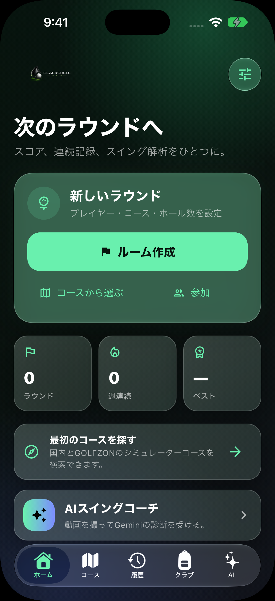
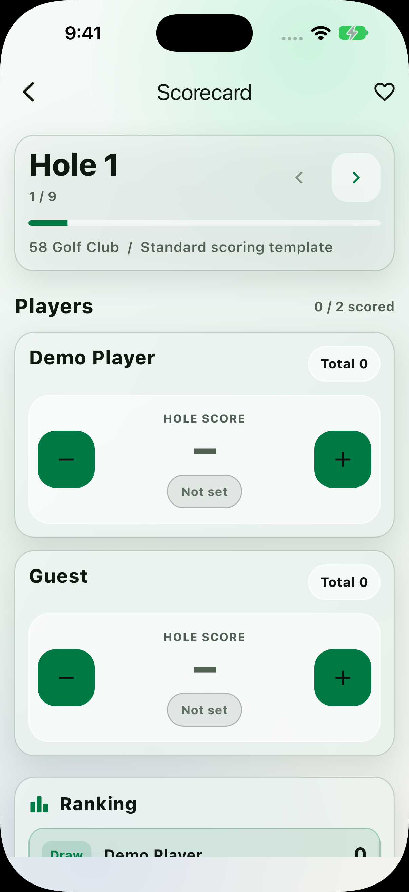

# BlackShell Golf

**An iPhone and Apple Watch scorecard with Gemini powered swing coaching.**

[](ios/Runner.xcworkspace)
[](ios/BlackShellWatch%20Watch%20App)
[](pubspec.yaml)
[](ios/Runner/AppDelegate.swift)
[](backend/gemini-worker.js)
[](https://github.com/taikiikuta0925-hub/BlackShell-Golf/actions/workflows/ci.yml)
[](LICENSE)

BlackShell Golf combines round scoring, course discovery, club management, swing
video analysis, Live Activities, Apple Watch controls, and Apple Fitness export
in one system aware interface. The iOS experience uses Apple's native glass and
tab bar APIs on supported systems while Flutter owns the product flow and data.

<p align="center">
  
  
</p>

See the [Xcode Simulator screenshot gallery](docs/SCREENSHOT_GALLERY.md) for the
course catalog, AI coach, scorecard, and Watch app.

## Product highlights

- **Practical navigation** — Home, Courses, Rounds, Bag, and AI are always one tap away in a native `UITabBar`.
- **Multiplayer scorecards** — score multiple players, keep an in progress round saved after every change, and review completed rounds.
- **Golf history** — show recent rounds, best score, and weekly playing streaks from local data.
- **Club bag** — keep the clubs you actually use, with a 14 club limit.
- **Course discovery** — search a broad Japan course directory and a curated 25 course GOLFZON simulator catalog.
- **Gemini swing coach** — select or record a short swing video and receive phase based observations and prioritized drills.
- **Apple Watch** — view the active round and adjust scores from the bundled watchOS app.
- **Live Activities** — keep the current hole and score visible on the Lock Screen and Dynamic Island.
- **Apple Fitness** — save a completed round to HealthKit as a golf workout after permission is granted.
- **System aware UI** — follow the device language and Light or Dark Mode by default, with Japanese and English support.

## Experience map

| Area | What it does |
| --- | --- |
| Home | Starts a round and summarizes rounds, streaks, best score, courses, and AI coaching. |
| Courses | Searches Japan courses and the public GOLFZON simulator catalog. |
| Rounds | Shows locally saved in progress and completed rounds. |
| Bag | Maintains the player's current club selection. |
| AI | Sends an explicitly selected swing clip to the configured Cloudflare Worker for Gemini analysis. |
| Scorecard | Scores multiple players with immediate autosave and a live ranking. |
| Watch and Live Activity | Mirrors the active hole, player, and score outside the main app. |

## Apple experience

BlackShell Golf targets iOS 17 and watchOS 10. On iOS 26 or later, native
`UIGlassEffect` surfaces and a real UIKit `UITabBar` provide Apple's Liquid
Glass presentation. Earlier supported systems use a readable blur fallback.

Starting a scorecard publishes round state through ActivityKit and
WatchConnectivity. Score edits and hole navigation update both surfaces.
Finishing or leaving the round ends the Live Activity and clears the Watch
state. Completed GOLFZON and practice rounds are recorded as indoor workouts;
other completed rounds are recorded as outdoor golf workouts.

The current Apple targets were verified with Xcode 27.1 on an iPhone 18 Pro
iOS 27 Simulator, including the Watch app and Live Activity extension.

## Run the app

Requirements:

- Flutter 3.41.9 with Dart 3.11.5
- macOS with Xcode and CocoaPods
- iOS 17 or later; watchOS 10 or later for the companion app
- Xcode 26 or later for Liquid Glass SDK support; Xcode 27 is used for verification

```bash
flutter pub get
cd ios
pod install
open Runner.xcworkspace
```

Select the **Runner** scheme and a paired iPhone Simulator, then press **Run**
(`⌘R`). For a physical device, select a development team for Runner,
BlackShellWatch Watch App, and BlackShellLiveActivity.

## Gemini and Cloudflare architecture

The Gemini API key is never embedded in the mobile app. A selected clip is sent
to the Cloudflare Worker in [`backend/gemini-worker.js`](backend/gemini-worker.js),
which validates the request and asks Gemini for structured coaching output.

| Endpoint | Purpose |
| --- | --- |
| `GET /health` | Reports whether the Worker has its Gemini secret configured. |
| `POST /analyze-swing` | Analyzes one supported swing video of at most 14 MB. |

The production Worker is deployed at
[`blackshell-golf-ai.tx-appe-chi.workers.dev`](https://blackshell-golf-ai.tx-appe-chi.workers.dev/health),
and the app uses it by default. To deploy the Worker to another Cloudflare
account:

```bash
cd backend
npx wrangler secret put GEMINI_API_KEY
npx wrangler secret put APP_BEARER_TOKEN  # optional
npx wrangler deploy
```

Override the production endpoint for development when needed:

```bash
flutter run \
  --dart-define=AI_API_BASE_URL=https://YOUR-WORKER.workers.dev
```

If `APP_BEARER_TOKEN` is configured, also pass
`--dart-define=BLACKSHELL_AI_TOKEN=...`. A token compiled into a distributed app
can be extracted. The deployed Worker includes an edge rate limit; production
operations should also use Gemini usage alerts and app attestation rather than
treating that token as the only control. See the [Worker guide](backend/README.md).

## GOLFZON catalog and account sync

The app includes a curated starter catalog sourced from GOLFZON's public course
library. Entries without verified per hole information use a clearly labelled
standard scoring template; the app does not present generated hole yardages as
official course data.

- Public global catalog: <https://www.golfzongolf.com/course-list>
- Official Japan catalog: <https://golfzon.jp/wp-content/uploads/2025/06/202506courselist.pdf>

No public consumer API for GOLFZON account, shot, or score synchronization was
found in the official material reviewed for this project. Live account sync
therefore requires an official GOLFZON partnership specification and
credentials. Private endpoints are not scraped.

## Repository structure

```text
backend/                      Cloudflare Worker and Gemini gateway
docs/                         Product screenshots and public documentation
ios/BlackShellLiveActivity/   ActivityKit extension
ios/BlackShellWatch Watch App watchOS companion
ios/Runner/                   Flutter host and native Apple bridges
ios/Shared/                   Activity attributes shared by Apple targets
lib/features/apple_sync/      Flutter channels for Watch, Live Activity, and HealthKit
lib/features/shot_analysis/   Video selection, upload, models, and coaching UI
lib/ui/                       Liquid Glass surfaces and native tab bar bridge
test/                         Flutter feature and catalog tests
```

## Verification

```bash
flutter analyze
flutter test
node --test backend/gemini-worker.test.js
```

The full Runner, Watch, and Live Activity graph can also be built from Xcode:

```bash
xcodebuild \
  -workspace ios/Runner.xcworkspace \
  -scheme Runner \
  -configuration Debug \
  -destination 'platform=iOS Simulator,name=iPhone 18 Pro,OS=27.0' \
  CODE_SIGNING_ALLOWED=NO \
  build
```

GitHub Actions runs the Flutter and Worker checks and the Apple target build for
every push and pull request.

## Privacy and data handling

- Scorecards, round history, streaks, and the club bag are stored locally.
- A swing video leaves the device only after the user selects it for analysis.
- The Worker forwards the clip to Gemini for that request and does not persist it.
- HealthKit access is write only and is requested before saving a completed round.
- Gemini and optional Worker secrets belong in Cloudflare Secret storage, never in the app or repository.

## Project status

BlackShell Golf is an actively developed product prototype. Live GOLFZON account
sync and verified per hole data are not included. GOLFZON names and course data
remain the property of their respective owners; catalog inclusion does not imply
affiliation or endorsement.

## License and asset policy

Source code is available under the [MIT License](LICENSE).

The BlackShell Golf name, logo, app icon, screenshots, screen recordings, visual
identity, and marketing assets are not included in the MIT grant. See the
[BlackShell Golf Brand and Media Terms](BRAND-ASSETS-LICENSE.md).
