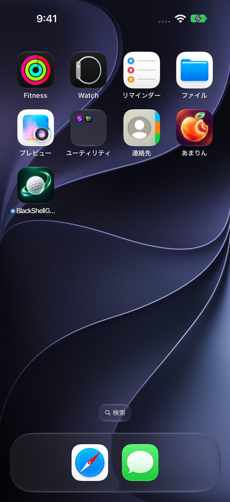
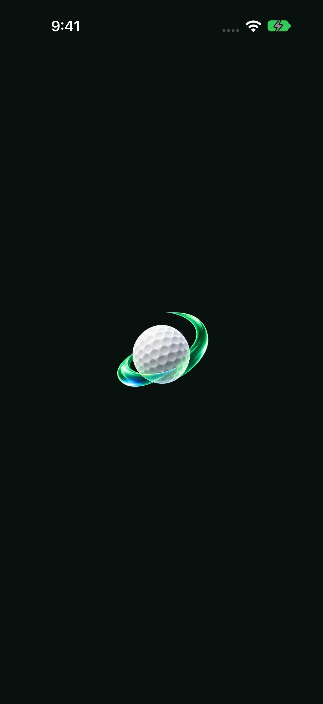
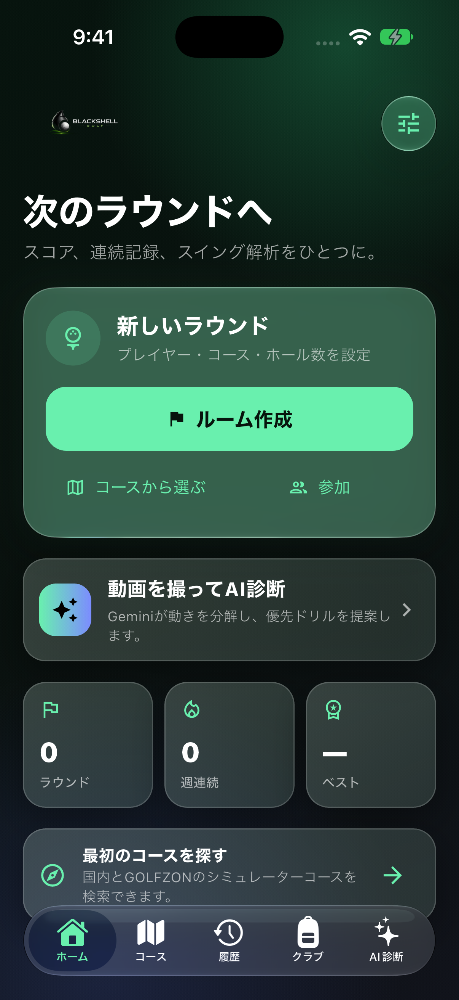
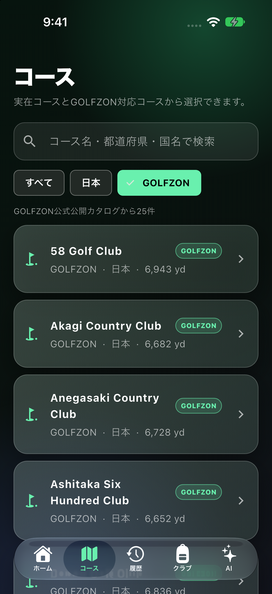
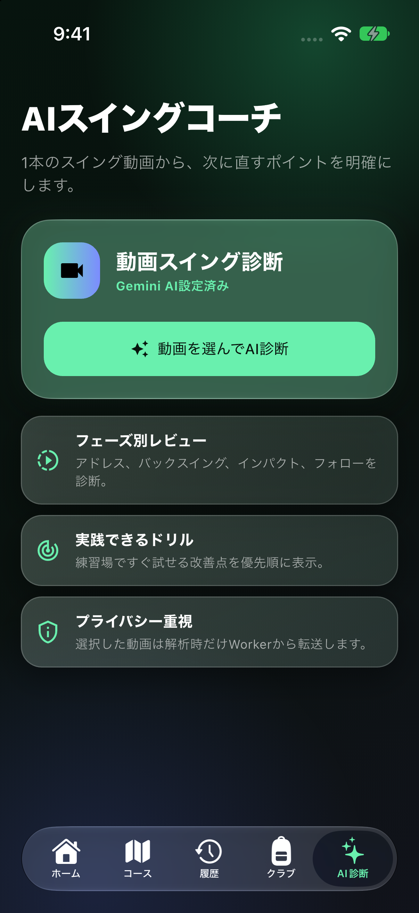
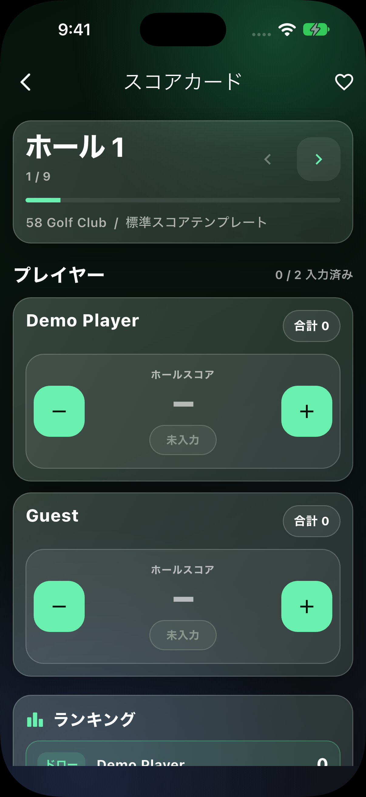
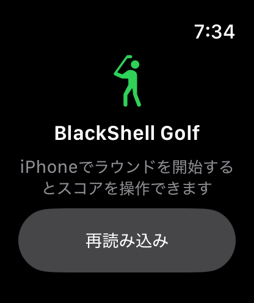

# BlackShell Golf Screenshot Gallery

Captured on October 8 and 9, 2026 with simulators installed by Xcode 27.1. The iPhone
images use an iPhone 18 Pro iOS 27 Simulator, and the Watch image uses a watchOS
27 Simulator. Japanese and English plus Light and Dark Mode are included to
verify system adaptation.

## Coverage

| Surface | Language / appearance | What is shown |
| --- | --- | --- |
| Identity | Japanese / Dark | New golf ball and Liquid Glass wind icon on the Home Screen and launch screen |
| Home | Japanese / Dark | Round entry point, one-tap AI diagnosis, summary cards, and native bottom navigation |
| Courses | Japanese / Dark | Curated public GOLFZON catalog and search controls |
| Scorecard | Japanese / Dark | Standard template label and unset score presentation |
| Scorecard | English / Light | System language, appearance, and status bar adaptation |
| AI Swing Coach | Japanese / Dark | Gemini configuration state and video diagnosis flow |
| Apple Watch | Japanese / Dark | Waiting state for an iPhone round |

## App identity and launch

  
  
  

## Core iPhone experience

  
  
  

## Adaptive scorecard

  
  

## Apple Watch

  

All images contain simulator only demo data. No personal device content or
production credentials are included.
